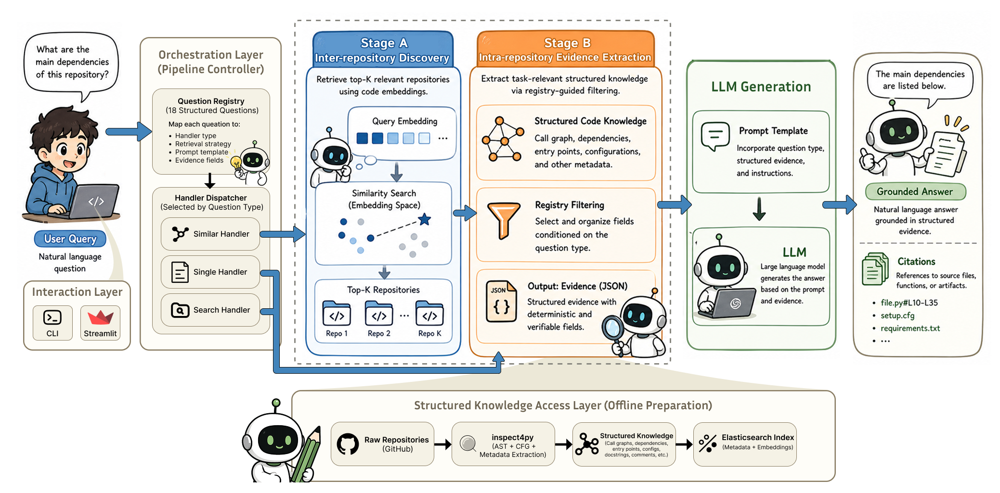

# RepoSnipy-LLM

**Structured Knowledge-Grounded Explanations for Scientific Software Mining**

RepoSnipy-LLM extends [RepoSnipy](https://github.com/RepoMining/RepoSnipy) with Retrieval-Augmented Generation (RAG), enabling developers and researchers to ask structured natural-language questions about Python repositories and receive grounded, evidence-backed answers.

<!-- > 📄 **Paper**: *RepoSnipy-LLM: Structured Knowledge-Grounded Explanations for Scientific Software Mining* — IEEE eScience 2026 -->

---

## Overview

Rather than returning a plain ranked list of similar repositories, RepoSnipy-LLM lets you ask meaningful questions such as:

- *What does this repository do?*
- *Which repositories are designed as reusable libraries?*
- *Which repositories include automated tests?*
- *Find repositories most similar to this one.*

All answers are grounded in structured repository knowledge extracted by [inspect4py](https://github.com/SoftwareUnderstanding/inspect4py) and stored in Elasticsearch, ensuring traceability and reproducibility. The system operationalizes the **FAIR principles for research software** (FAIR4RS) across all 18 structured questions.

---

## System Architecture



The system follows a three-tier layered design:

- **Interaction Layer**: CLI and Streamlit Web UI
- **Orchestration Layer**: Pipeline controller with Question Registry and Handler Dispatcher
- **Structured Knowledge Access Layer**: Elasticsearch-backed knowledge base (offline preparation via inspect4py)

The two-stage RAG pipeline:
- **Stage A (Inter-repository Discovery)**: Retrieves top-K candidate repositories using `embedding_code` cosine similarity — activated for the `similar` handler only
- **Stage B (Intra-repository Evidence Extraction)**: Dynamically assembles task-specific structured metadata (directory trees, dependency lists, software invocation metadata, etc.) guided by the Question Registry

---

## Features

- **18 structured questions** across 5 task categories, aligned with FAIR principles
- **Three handler types**: `single` (single-repo analysis), `search` (multi-repo comparison), `similar` (embedding-based discovery)
- **Two-stage RAG pipeline**: Stage A (embedding retrieval) + Stage B (structured evidence assembly) + LLM generation
- **Multiple LLM backends**: DeepSeek-V3, GLM-4.7-Flash (ZhipuAI), Ollama
- **Streamlit Web UI** for interactive exploration
- **CLI** for scripted and reproducible experiments
- **Full JSON logging** of questions, contexts, prompts, and answers

---

## Task Categories & Questions

| Task | # | Question | Handler |
|------|---|----------|---------|
| **Repository Understanding** | Q1 | What does this repository do? | single |
| | Q2 | What are the similarities and differences between repositories? | search |
| | Q3 | Find repositories similar to a given one | similar |
| **Architecture** | Q1 | Which repositories are organised into clearly separated modules or packages? | search |
| | Q2 | Which repositories show a layered structure? | search |
| | Q3 | Which repositories are designed as reusable libraries rather than standalone applications? | search |
| | Q4 | Which repositories primarily consist of scripts rather than reusable modules? | search |
| **Execution** | Q1 | Which repositories provide a clear entry point for execution? | search |
| | Q2 | Which repositories are designed to be executed in batch mode rather than interactively? | search |
| | Q3 | Which repositories rely on configuration files or parameters to control execution? | search |
| **Implementation** | Q1 | How does this repository read input data? | single |
| | Q2 | Which repositories rely heavily on external libraries or frameworks? | search |
| | Q3 | Which repositories include automated tests or testing infrastructure? | search |
| | Q4 | Which repositories provide structured documentation beyond a basic README? | search |
| **Reuse** | Q1 | Which repositories appear easy to reuse or extend? | search |
| | Q2 | Which repositories show signs of high structural complexity? | search |
| | Q3 | Which repositories are most similar to a given repository in terms of structure and functionality? | similar |
| | Q4 | Where in the repository is the core functionality implemented? | single |

---

## Installation

### Prerequisites

- Python 3.10+
- Elasticsearch 9.3 (Docker recommended)
- inspect4py (for data preparation)
- A supported LLM API key (DeepSeek, ZhipuAI) or Ollama running locally

### Install dependencies

```bash
pip install -r requirements.txt
```

### Environment variables

Create a `.env` file in the project root:

```env
ES_URL=http://localhost:9200
ES_API_KEY=your_elasticsearch_api_key

DEEPSEEK_API_KEY=your_deepseek_api_key
ZHIPU_API_KEY=your_zhipu_api_key
```

---

## Data Preparation

The pipeline requires repositories to be indexed in Elasticsearch. The dataset construction follows a deterministic 12-step pipeline implemented as numbered scripts. Run the following scripts in order:

```bash
# 1. Fetch repository list from Awesome Python
python scripts/1_fetch_process_awesome-python.py

# 2. Clone and analyse repositories with inspect4py
python scripts/2_inspect4py_analyse_awesome-python.py

# 3. Index raw inspect4py output into Elasticsearch
python scripts/3_indexer_raw.py

# 4. Build the enriched index with structured fields
python scripts/5_indexer_processed.py

# 5. Generate UniXcoder embeddings and fill into ES
python scripts/7_generate_embeddings.py
python scripts/7_fill_embeddings.py
python scripts/11_fill_sub_embeddings.py

# 6. Generate README summaries (uses GLM-4.7-Flash)
python scripts/8_fill_readme_summary.py

# 7. Fill category labels
python scripts/10_fill_categories.py

# 8. Prepare final evaluation dataset
python scripts/12_save_final_datasets.py
```

---

## Usage

### Streamlit UI

```bash
streamlit run app.py
```

Open `http://localhost:8501` in your browser.

### CLI

```bash
# List all tasks
python -m src.cli --list-tasks

# List questions for a task
python -m src.cli --task repository_understanding --list-task-questions

# Single repository analysis (single handler)
python -m src.cli \
  --task repository_understanding \
  --question 1 \
  --repo pallets/flask \
  --model deepseek:deepseek-chat

# Compare two repositories (search handler)
python -m src.cli \
  --task repository_understanding \
  --question 2 \
  --repo pallets/flask django/django \
  --model deepseek:deepseek-chat

# Find similar repositories (similar handler)
python -m src.cli \
  --task repository_understanding \
  --question 3 \
  --repo pallets/flask \
  --topk 10 \
  --model deepseek:deepseek-chat

# Save logs for reproducibility
python -m src.cli \
  --task architecture \
  --question 1 \
  --repo pallets/flask django/django \
  --model deepseek:deepseek-chat \
  --logdir logs/my_experiment
```

### Supported models

| Provider | Format | Example models |
|----------|--------|----------------|
| DeepSeek | `deepseek:<model>` | `deepseek:deepseek-chat` (DeepSeek-V3) |
| ZhipuAI | `zhipu:<model>` | `zhipu:glm-4.7-flash` (GLM-4.7-Flash) |
| Ollama | `ollama:<model>` | `ollama:qwen3:8b` |

---

## Evaluation

### Stage A: Retrieval Evaluation

Compares **ten retrieval methods** — BM25, five individual embedding variants (`embedding_code`, `embedding_doc`, `embedding_readme`, `embedding_requirement`, `repo-embedding`), and four combined strategies (`code+doc`, `code+readme`, `code+doc+readme`, `code+doc+readme+req`) — using Precision@K, Recall@K, F1@K, and NDCG@K for K ∈ {5, 10}:

```bash
cd evaluations
python eval_stage_a.py
```

Results saved to `evaluations/results/stage_a_*.csv`.

**Key finding**: `embedding_code` achieves the best single-embedding performance (P@5 = 0.371, NDCG@5 = 0.420), outperforming the full 3,072-dimensional `repo-embedding`. Adding requirements embeddings consistently degrades performance.

### RAGAS Evaluation

Evaluates generation quality across 656 question-answer triples using Faithfulness, Answer Relevancy, and Context Precision (DeepSeek-V3 as LLM judge):

```bash
cd evaluations

# Step 1: Collect (question, context, answer) triples
python collect_ragas_data.py --model deepseek:deepseek-chat

# Step 2: Run RAGAS evaluation
python eval_ragas.py
```

Results saved to `evaluations/results/ragas_*.csv`.

**Key results**: Faithfulness = 0.865, Context Precision = 0.971, Answer Relevancy = 0.682.

---

## Project Structure

```
RepoSnipy-LLM/
├── app.py                      # Streamlit UI
├── requirements.txt
├── .env                        # API keys (not committed)
│
├── src/
│   ├── cli.py                  # Command-line interface
│   ├── pipeline.py             # RAG pipeline controller
│   ├── data_loader.py          # Elasticsearch data loading
│   ├── prompt_builder.py       # Prompt construction
│   ├── questions.py            # Task and question registry
│   ├── llm.py                  # LLM client (DeepSeek/ZhipuAI/Ollama)
│   ├── logger.py               # Run logging
│   └── output.py               # CLI output formatting
│
├── prompts/                    # Task-specific prompt templates
│   ├── batch_summarise.txt
│   ├── repository_understanding_*.txt
│   ├── architecture_*.txt
│   ├── execution_*.txt
│   ├── implementation_*.txt
│   └── reuse_*.txt
│
├── scripts/                    # Data preparation pipeline (12 steps)
│   ├── 1_fetch_process_awesome-python.py
│   ├── 2_inspect4py_analyse_awesome-python.py
│   ├── 3_indexer_raw.py
│   ├── 5_indexer_processed.py
│   ├── 7_generate_embeddings.py
│   ├── 7_fill_embeddings.py
│   ├── 8_fill_readme_summary.py
│   ├── 9_fill_readme_file_summary.py
│   ├── 10_fill_categories.py
│   ├── 11_fill_sub_embeddings.py
│   └── 12_save_final_datasets.py
│
├── evaluations/
│   ├── config.py               # Evaluation configuration
│   ├── eval_stage_a.py         # Stage A retrieval evaluation (10 methods)
│   ├── collect_ragas_data.py   # RAGAS data collection
│   ├── eval_ragas.py           # RAGAS evaluation
│   └── results/                # Evaluation outputs
│
├── figs/
│   └── Architecture.png        # System architecture diagram
│
└── data/
    ├── awesome-python_data.json
    ├── AWESOME-PYTHON-REPOS.pkl
    └── AWESOME-PYTHON-REPOS_FINAL.pkl
```

---

## Dataset

The system uses **487 Python repositories** from the [Awesome Python](https://github.com/vinta/awesome-python) list (April 2026 snapshot), spanning **69 categories**. After filtering 13 repositories for which inspect4py failed to produce valid output, 487 repositories were retained and indexed in Elasticsearch with:

- **Structured metadata** from inspect4py: directory trees, software invocation metadata, dependency lists, test infrastructure indicators, classes, functions, and docstrings
- **README summaries**: structured summaries generated by GLM-4.7-Flash, extracting purpose, software type, installation procedure, and usage patterns
- **UniXcoder embeddings**: full repository embedding (3,072-dim, `repo-embedding`) and four sub-embeddings (768-dim each: `embedding_code`, `embedding_doc`, `embedding_requirement`, `embedding_readme`)
- **Awesome Python category labels**: used as silver standard for retrieval ground truth

| Property | Value |
|----------|-------|
| Total repositories indexed | 487 |
| Awesome Python categories | 69 |
| Reference repositories (Stage A) | 41 |
| RAGAS triples (single-handler) | 123 |
| RAGAS triples (search-handler) | 533 |
| Total RAGAS evaluation triples | 656 |

---

## Acknowledgements

This project builds on:

- [RepoSim4Py](https://github.com/RepoMining/RepoSim4Py) — repository embedding pipeline
- [inspect4py](https://github.com/SoftwareUnderstanding/inspect4py) — static code analysis
- [UniXcoder](https://github.com/microsoft/CodeBERT/tree/master/UniXcoder) — code representation model
- [Awesome Python](https://github.com/vinta/awesome-python) — curated repository dataset
- [RAGAS](https://github.com/explodinggradients/ragas) — RAG evaluation framework

<!-- --- -->

<!-- ## Citation

If you use RepoSnipy-LLM in your research, please cite:

```bibtex
@inproceedings{zhang2026reposnipy,
  title     = {RepoSnipy-LLM: Structured Knowledge-Grounded Explanations for Scientific Software Mining},
  author    = {Zhang, Honglin and Filgueira, Rosa and Ye, Juan and Fang, Lei},
  booktitle = {Proceedings of the 22nd IEEE International Conference on eScience},
  year      = {2026}
}
``` -->

---

## License

MIT License